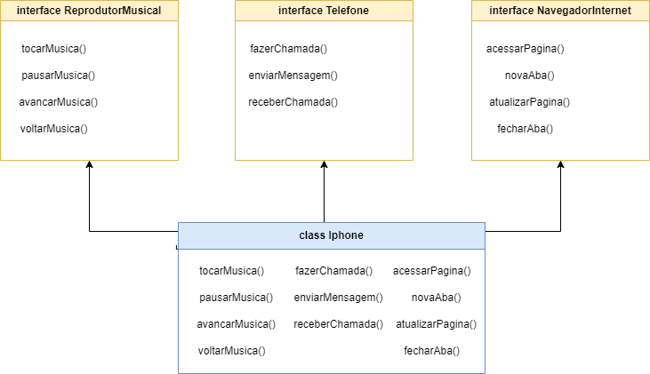

# Projeto iPhone 2007 - Modelagem UML

> Confira esse e outros desafios no meu perfil na [Dio.me](https://www.dio.me/users/gonzagas_dudu).

Este projeto é uma modelagem UML das principais funcionalidades do iPhone de 2007, representando seus papéis como:
- **Reprodutor Musical**
- **Telefone**
- **Navegador de Internet**

A modelagem foi feita em **Java** utilizando os conceitos de **Programação Orientada a Objetos (POO)**, como interfaces e classes, para descrever as principais funcionalidades do iPhone.

## Funcionalidades

### 1. Reprodutor Musical
- **Tocar** músicas.
- **Pausar** músicas.
- **Avançar** e **voltar** entre músicas.

### 2. Telefone
- **Fazer** chamadas telefônicas.
- **Receber** chamadas.
- **Enviar** mensagens de texto.

### 3. Navegador de Internet
- **Acessar** páginas da web.
- **Atualizar** páginas abertas.
- **Abrir** e **fechar** abas.

## Diagrama UML

Abaixo está o diagrama UML que representa as classes e interfaces do projeto.



## Estrutura do Código

### Interfaces

- **ReprodutorMusical**: Define métodos para tocar, pausar e controlar a reprodução de músicas.
- **Telefone**: Define métodos para realizar e receber chamadas, bem como enviar mensagens.
- **NavegadorInternet**: Define métodos para navegar na web e manejar abas.

### Classe iPhone

A classe `iPhone` implementa todas as três interfaces, representando o comportamento multifuncional do dispositivo.

```java
public class iPhone implements ReprodutorMusical, Telefone, NavegadorInternet {
    // Implementação dos métodos de cada interface...
}
